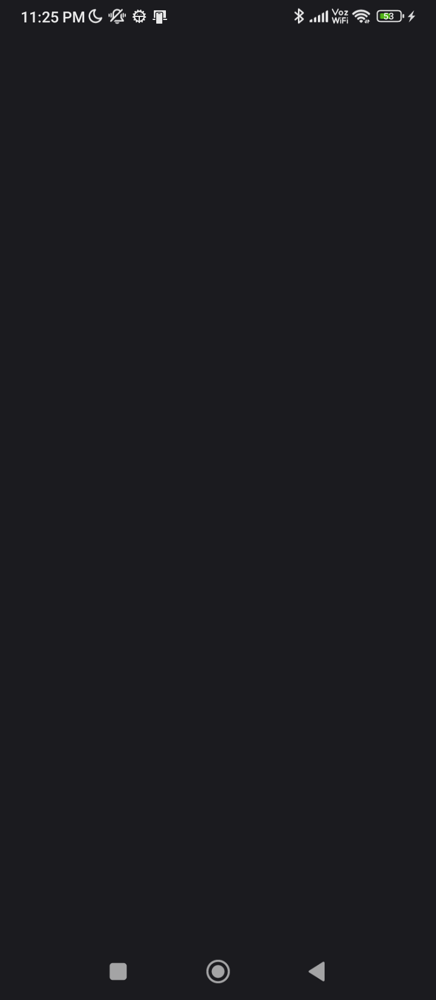
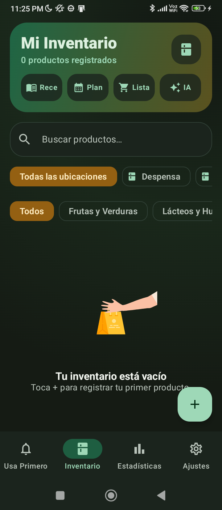
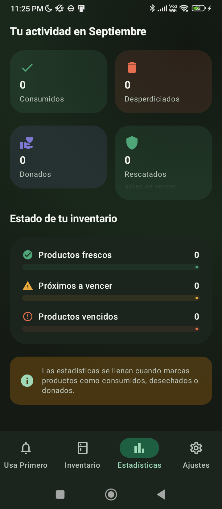
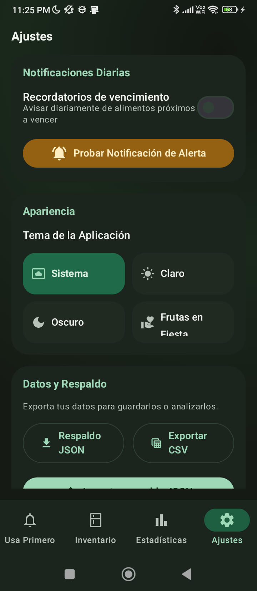

<div align="center">
  
  <h1>Despensa al Día</h1>
  <p><strong>Tu despensa, ordenada por urgencia.</strong></p>
  <p>Android offline-first para reducir desperdicio, ahorrar dinero y decidir qué usar primero.</p>

  <p>
    <a href="https://github.com/fguzman-stack/Despensadeldia/releases/latest/download/despensa-al-dia-1.1.0-signed.apk"></a>
    <a href="https://github.com/fguzman-stack/Despensadeldia/releases"></a>
  </p>
  <p>
    
    
    
    
  </p>
</div>

## Descargar e instalar

La última versión, con APK firmada:

- ⬇ **[Descargar APK v1.1.0](https://github.com/fguzman-stack/Despensadeldia/releases/latest/download/despensa-al-dia-1.1.0-signed.apk)** (Android 7.0+)
- Todas las versiones: https://github.com/fguzman-stack/Despensadeldia/releases

Para instalar: descarga el `.apk`, ábrelo en tu Android y permite “instalar aplicaciones de origen desconocido” si lo pide. La APK está firmada; la llave privada no se publica en el repo.

El inventario funciona sin cuenta, sin servidor propio y sin conexión. Algunas funciones opcionales usan internet para buscar códigos de barras, recetas, tasas de cambio o respuestas Gemini si el usuario configura una API key.

## Capturas

Capturas de las pantallas principales (tema claro). Los fuentes vectoriales están en `docs/screenshots/*.svg`:

<p align="center">
  
  
  
  
</p>

El modo `Despensa Pop` (Ajustes > Apariencia) es un tema claro, colorido e infantil con acentos rosa, menta y amarillo.

## Funciones

- Pantalla `Usa Primero` con productos vencidos, de hoy, de mañana y de la semana.
- Inventario con búsqueda, filtros por ubicación/categoría y gestos para consumir o descartar.
- Registro rápido con plantillas, productos frecuentes, stock mínimo, precios, marcas y notas.
- Escáner de código de barras con autocompletado desde Open Food Facts cuando hay conexión.
- Recetas locales y recetas online opcionales con TheMealDB.
- Lista de compras compartible y revisión rápida antes de comprar.
- Planificador semanal de comidas.
- Estadísticas de consumo, desperdicio, donaciones, rescates y salud del inventario.
- Notificaciones locales y widget de pantalla de inicio.
- Exportación e importación de respaldo en JSON, más exportación CSV.
- Temas claro, oscuro y “Despensa Pop”, un modo colorido e infantil.

## Privacidad

- Los datos principales se guardan localmente con Room.
- No hay cuentas, analítica, anuncios ni backend propio.
- Las integraciones online son opcionales y visibles para el usuario.
- Si usas Gemini, tu pregunta y el contexto de despensa pueden enviarse a Google usando tu API key.
- Revisa `PRIVACY.md` para más detalle.

## Stack

- Kotlin
- Jetpack Compose + Material 3
- Room
- CameraX + ML Kit Barcode Scanning
- Lottie Compose
- Coroutines + StateFlow
- JUnit/Robolectric

## Ejecutar En Local

Requisitos:

- Android Studio reciente
- JDK 17
- Android SDK 36

Comandos:

```bash
./gradlew testDebugUnitTest assembleDebug
./gradlew installDebug
```

## Firmar Release

El proyecto no incluye llaves privadas. Para generar una APK release firmada, define estas variables de entorno antes de compilar:

```bash
export KEYSTORE_PATH=/ruta/a/upload.jks
export STORE_PASSWORD=tu_password
export KEY_PASSWORD=tu_password
./gradlew assembleRelease
```

En Windows PowerShell:

```powershell
$env:KEYSTORE_PATH="C:\ruta\upload.jks"
$env:STORE_PASSWORD="tu_password"
$env:KEY_PASSWORD="tu_password"
.\gradlew.bat assembleRelease
```

La salida queda en `app/build/outputs/apk/release/app-release.apk`.

## Contribuir

Las contribuciones son bienvenidas. Antes de abrir un PR:

- Mantén el core offline-first.
- No agregues cuentas, anuncios, tracking ni servicios obligatorios.
- Documenta cualquier dato que salga del dispositivo.
- Ejecuta `./gradlew testDebugUnitTest assembleDebug`.

Revisa `CONTRIBUTING.md`, `SECURITY.md` y el código de conducta en `.github/CODE_OF_CONDUCT.md`.

## Licencia

MIT. Ver `LICENSE`.
